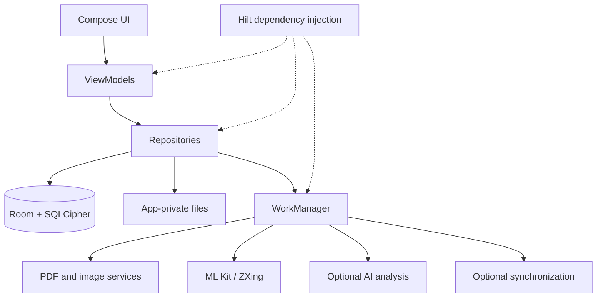
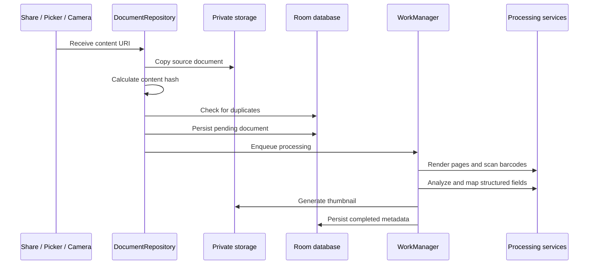

<div align="center">

# PDF Wallet

### A secure, intelligent document wallet for Android

Import, process, organize, and retrieve travel, identity, and everyday documents from one privacy-focused application.

<p><strong>Local-first storage&nbsp;&nbsp;•&nbsp;&nbsp;Asynchronous processing&nbsp;&nbsp;•&nbsp;&nbsp;Adaptive Material 3 UI</strong></p>

<p>
  
  
  
  
  
  
  
</p>

</div>

> **PDF Wallet** turns scattered PDFs, tickets, boarding passes, passes, IDs, and certificates into a structured, searchable wallet with local-first storage and asynchronous processing.

<div align="center">

| Capture | Process | Organize | Protect |
| :---: | :---: | :---: | :---: |
| Share sheet<br />Picker<br />Camera | PDF<br />Barcodes<br />Structured data | Search<br />Collections<br />Paging | Encryption<br />Biometrics<br />Private files |

</div>

## Contents

- [Highlights](#-highlights)
- [System architecture](#-system-architecture)
- [Document pipeline](#-document-pipeline)
- [Technology stack](#-technology-stack)
- [Project structure](#-project-structure)
- [Requirements](#-requirements)
- [Configuration](#-configuration)
- [Developer setup](#-developer-setup)
- [Build and test](#-build-and-test)
- [Security and privacy](#-security-and-privacy)
- [Development principles](#-development-principles)
- [Changelog](#-changelog)
- [Contributing](#-contributing)
- [License](#-license)

---

## ✨ Highlights

<table>
  <tr>
    <td width="50%">
      <h3>📥 Flexible capture</h3>
      Import from the Android share sheet, file picker, or camera scanner. Supports PDFs, images, and scanned documents.
    </td>
    <td width="50%">
      <h3>🧠 Structured extraction</h3>
      Convert document content into searchable metadata and domain-specific fields using on-device ML or optional AI analysis.
    </td>
  </tr>
  <tr>
    <td>
      <h3>⚡ Background processing</h3>
      Process documents reliably with WorkManager — retries, progress notifications, and offline queuing built in.
    </td>
    <td>
      <h3>🔎 Fast retrieval</h3>
      Search, filter, sort, page, and browse documents by collection. Find any document instantly.
    </td>
  </tr>
  <tr>
    <td>
      <h3>🔐 Local-first security</h3>
      Files live in app-private storage, metadata is encrypted with SQLCipher, and access is protected by biometrics.
    </td>
    <td>
      <h3>📐 Adaptive UI</h3>
      Responsive Material 3 navigation across phones, tablets, landscape mode, and foldables.
    </td>
  </tr>
  <tr>
    <td>
      <h3>☁️ Optional cloud sync</h3>
      Sync documents to Google Drive when you need it. Fully optional — the app works completely offline without it.
    </td>
    <td>
      <h3>📦 Backup &amp; restore</h3>
      Export and restore your entire wallet as a local ZIP backup. Your data, your control.
    </td>
  </tr>
</table>

### Core workflows

| Workflow | Supported behavior |
| --- | --- |
| Import | Share sheet, file picker, camera capture |
| Processing | PDF rendering, thumbnails, barcode/QR scanning, structured analysis |
| Organization | Search, filtering, sorting, paging, collections |
| Lifecycle | Expiry checks, waitlist checks, retryable processing |
| Protection | SQLCipher-backed database and biometric app lock |
| Data portability | Local ZIP backup and restore |
| Integrations | Optional authentication, AI analysis, Google Drive sync, and home-screen widget |

---

## 🧩 System architecture



### Architectural boundaries

| Layer | Responsibility |
| --- | --- |
| **Presentation** | Compose screens, navigation, adaptive layouts, themes, widgets, and UI state |
| **ViewModel** | Lifecycle-aware state, user actions, and UI events |
| **Repository** | Import coordination, deduplication, persistence, and work scheduling |
| **Data** | Room entities, DAOs, migrations, converters, DataStore, and file management |
| **Service** | PDF conversion, thumbnails, barcode processing, AI mapping, lifecycle checks, and sync |
| **Worker** | Durable background execution isolated from composable code |

---

## 🔄 Document pipeline



Processing stages:

1. Receive and normalize a content URI.
2. Copy the source into app-private storage.
3. Calculate a content hash and prevent duplicate imports.
4. Persist a pending document record.
5. Enqueue durable background work.
6. Render document pages and scan barcodes locally.
7. Run the configured structured extraction path.
8. Map results into the application document model.
9. Generate a thumbnail and update processing state.

---

## 🛠️ Technology stack

<table>
  <tr><th>Layer</th><th>Technology</th><th>Purpose</th></tr>
  <tr><td>Language</td><td>Kotlin 2.2.10</td><td>Primary language</td></tr>
  <tr><td>UI</td><td>Jetpack Compose + Material 3 Adaptive</td><td>Declarative, responsive UI</td></tr>
  <tr><td>Architecture</td><td>MVVM + Repository pattern</td><td>Clean separation of concerns</td></tr>
  <tr><td>Dependency injection</td><td>Dagger Hilt</td><td>DI across all layers</td></tr>
  <tr><td>Persistence</td><td>Room + SQLCipher + DataStore</td><td>Encrypted database and preferences</td></tr>
  <tr><td>Background execution</td><td>WorkManager + Coroutines</td><td>Durable background jobs</td></tr>
  <tr><td>PDF and images</td><td>PdfBox Android + Coil</td><td>PDF rendering and image loading</td></tr>
  <tr><td>OCR and barcodes</td><td>ML Kit + ZXing</td><td>Barcode scanning and text recognition</td></tr>
  <tr><td>AI analysis</td><td>Gemini SDK + Firebase AI Logic</td><td>Optional structured extraction</td></tr>
  <tr><td>Camera</td><td>CameraX</td><td>Document and barcode capture</td></tr>
  <tr><td>Cloud sync</td><td>Google Drive API</td><td>Optional backup and sync</td></tr>
  <tr><td>Security</td><td>SQLCipher + Biometric + Security Crypto</td><td>Encryption and access control</td></tr>
  <tr><td>Build system</td><td>Gradle Kotlin DSL</td><td>Build configuration</td></tr>
  <tr><td>CI</td><td>GitHub Actions</td><td>Automated build and test</td></tr>
</table>

---

## 📁 Project structure

```text
app/src/main/java/com/pdfwallet/
├── data/
│   ├── db/              # Room entities, DAOs, migrations, converters
│   ├── local/           # Private files and backup/restore
│   └── repository/      # Persistence and integration coordination
├── di/                  # Hilt, WorkManager, and application modules
├── service/
│   ├── ai/              # Structured document analysis and mapping
│   ├── pdf/             # PDF conversion, barcodes, and thumbnails
│   ├── sync/            # Synchronization services and workers
│   └── worker/          # Durable background jobs
├── ui/
│   ├── auth/            # Authentication screens
│   ├── capture/         # Camera and share-sheet flows
│   ├── collections/     # Category-based browsing
│   ├── detail/          # Document detail views
│   ├── files/           # File browsing
│   ├── home/            # Dashboard
│   ├── lock/            # Biometric access control
│   ├── settings/        # Preferences and data controls
│   ├── theme/           # Design system (colors, typography, glassmorphism)
│   ├── wallet/          # Document cards and lists
│   └── widget/          # Home-screen widget
└── util/                # Logging, connectivity, and barcode utilities
```

---

## 💻 Requirements

| Requirement | Value |
| --- | --- |
| Android Studio | Latest stable + Android SDK 36 |
| JDK | 21 |
| Android API | 26+ (Android 8.0 Oreo) |
| Google Play services | Required for ML Kit, Auth, and Drive features |

> **Note:** Firebase configuration (`google-services.json`) is **optional**. The app compiles and runs without it; only Firebase-backed features will be unavailable.

---

## ⚙️ Configuration

Keep environment-specific values in local, untracked configuration files. Never commit credentials, tokens, private keys, or service configuration containing secrets.

Before building:

1. Copy `setup_guide/local.properties.example` → `local.properties` and fill in your values.
2. *(Optional)* Place your own `google-services.json` at `app/google-services.json` to enable Firebase features.
3. Verify that `local.properties` and `app/google-services.json` are listed as ignored by Git.

The application should remain usable when optional integrations are disabled or unavailable.

---

## 🧑‍💻 Developer setup

See the complete setup guide in [`setup_guide/SETUP.md`](setup_guide/SETUP.md).

The repository includes [`setup_guide/local.properties.example`](setup_guide/local.properties.example)
and [`setup_guide/google-services.json.example`](setup_guide/google-services.json.example) as
safe templates. Copy and configure them locally; never commit the resulting
secret or machine-specific files.

---

## 🚀 Build and test

### Build

```bash
# Linux / macOS
./gradlew assembleDebug
./gradlew assembleRelease

# Windows
.\gradlew.bat assembleDebug
.\gradlew.bat assembleRelease
```

### Test

```bash
# Linux / macOS
./gradlew testDebugUnitTest
./gradlew connectedDebugAndroidTest

# Windows
.\gradlew.bat testDebugUnitTest
.\gradlew.bat connectedDebugAndroidTest
```

Test coverage includes parsing and mapping, theme behavior, database migrations, Compose interactions, navigation, and Android integration flows.

---

## 🛡️ Security and privacy

- Source documents are stored in **application-private storage** — inaccessible to other apps.
- Document metadata is persisted in an **encrypted Room/SQLCipher database**.
- **Biometric authentication** can protect application access.
- PDF rendering and barcode processing run **entirely on-device**.
- AI analysis is **optional** and should be enabled according to the deployment privacy policy.
- Backups may contain sensitive user documents and must be treated as confidential.
- Logs must not contain raw document contents or credentials.

To report a security vulnerability, see [`SECURITY.md`](SECURITY.md).

---

## 🧭 Development principles

- Keep platform and long-running work outside composables.
- Use lifecycle-aware collection for Flow-based UI state.
- Preserve migration tests when changing the database schema.
- Prefer typed models and explicit error states at integration boundaries.
- Add unit tests for parsing, mapping, deduplication, and lifecycle rules.
- Add instrumentation tests for navigation, database migrations, and Compose behavior.
- Keep generated build output and local secrets out of version control.

---

## 📋 Changelog

See [`CHANGELOG.md`](CHANGELOG.md) for a full version history.

---

## 🤝 Contributing

Please read [`CONTRIBUTING.md`](CONTRIBUTING.md) before opening an issue or pull request.

---

## 📄 License

PDF Wallet is distributed under the [MIT License](LICENSE).

<div align="center">

**Built with Kotlin, Jetpack Compose, and a privacy-first mindset.**

⭐ If you find this project useful, consider giving it a star!

</div>
