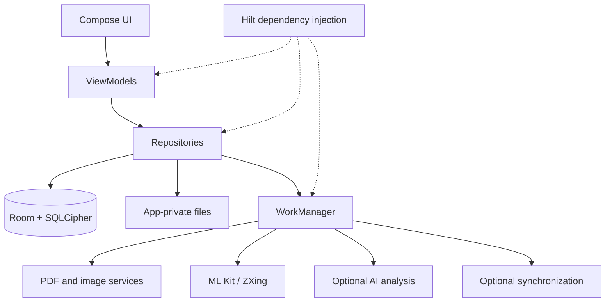
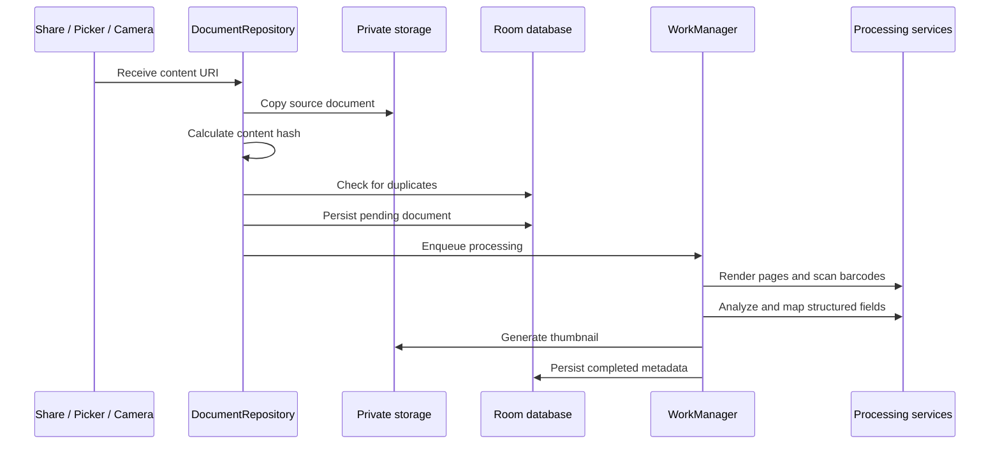

<div align="center">

# PDF Wallet

### A secure, intelligent document wallet for Android

Import, process, organize, and retrieve travel, identity, and everyday documents from one privacy-focused application.

<p><strong>Local-first storage&nbsp;&nbsp;•&nbsp;&nbsp;Asynchronous processing&nbsp;&nbsp;•&nbsp;&nbsp;Adaptive Material 3 UI</strong></p>

<p>
  
  
  
  
</p>

</div>

> **PDF Wallet** turns scattered PDFs, tickets, boarding passes, passes, IDs, and certificates into a structured, searchable wallet with local-first storage and asynchronous processing.

<div align="center">

| Capture | Process | Organize | Protect |
| :---: | :---: | :---: | :---: |
| Share sheet<br />Picker<br />Camera | PDF<br />Barcodes<br />Structured data | Search<br />Collections<br />Paging | Encryption<br />Biometrics<br />Private files |

</div>

## Contents

- [Highlights](#-highlights)
- [System architecture](#-system-architecture)
- [Document pipeline](#-document-pipeline)
- [Technology stack](#-technology-stack)
- [Project structure](#-project-structure)
- [Requirements](#-requirements)
- [Configuration](#-configuration)
- [Developer setup](#-developer-setup)
- [Build and test](#-build-and-test)
- [Security and privacy](#-security-and-privacy)
- [Development principles](#-development-principles)
- [Contributing](#-contributing)
- [License](#-license)

---

## ✨ Highlights

<table>
  <tr>
    <td width="50%">
      <h3>📥 Flexible capture</h3>
      Import from the Android share sheet, file picker, or camera scanner.
    </td>
    <td width="50%">
      <h3>🧠 Structured extraction</h3>
      Convert document content into searchable metadata and domain-specific fields.
    </td>
  </tr>
  <tr>
    <td>
      <h3>⚡ Background processing</h3>
      Process documents reliably with WorkManager, retries, notifications, and offline queuing.
    </td>
    <td>
      <h3>🔎 Fast retrieval</h3>
      Search, filter, sort, page, and browse documents by collection.
    </td>
  </tr>
  <tr>
    <td>
      <h3>🔐 Local-first security</h3>
      Keep files private, encrypt metadata at rest, and protect access with biometrics.
    </td>
    <td>
      <h3>📐 Adaptive UI</h3>
      Use responsive Material 3 navigation across phones, tablets, landscape, and foldables.
    </td>
  </tr>
</table>

### Core workflows

| Workflow | Supported behavior |
| --- | --- |
| Import | Share sheet, file picker, camera capture |
| Processing | PDF rendering, thumbnails, barcode/QR scanning, structured analysis |
| Organization | Search, filtering, sorting, paging, collections |
| Lifecycle | Expiry checks, waitlist checks, retryable processing |
| Protection | SQLCipher-backed database and biometric app lock |
| Data portability | Local ZIP backup and restore |
| Integrations | Optional authentication, AI analysis, synchronization, and widget support |

---

## 🧩 System architecture



### Architectural boundaries

- **Presentation**: Compose screens, navigation, adaptive layouts, themes, widgets, and UI state
- **ViewModel layer**: Lifecycle-aware state, user actions, and UI events
- **Repository layer**: Import coordination, deduplication, persistence, and work scheduling
- **Data layer**: Room entities, DAOs, migrations, converters, DataStore, and file management
- **Service layer**: PDF conversion, thumbnails, barcode processing, AI mapping, lifecycle checks, and sync
- **Worker layer**: Durable background execution isolated from composable code

---

## 🔄 Document pipeline



Processing stages:

1. Receive and normalize a content URI.
2. Copy the source into app-private storage.
3. Calculate a content hash and prevent duplicate imports.
4. Persist a pending document record.
5. Enqueue durable background work.
6. Render document pages and scan barcodes locally.
7. Run the configured structured extraction path.
8. Map results into the application document model.
9. Generate a thumbnail and update processing state.

---

## 🛠️ Technology stack

<table>
  <tr><th>Layer</th><th>Implementation</th></tr>
  <tr><td>Language</td><td>Kotlin</td></tr>
  <tr><td>UI</td><td>Jetpack Compose, Material 3, Material 3 Adaptive</td></tr>
  <tr><td>Architecture</td><td>MVVM and repository pattern</td></tr>
  <tr><td>Dependency injection</td><td>Dagger Hilt</td></tr>
  <tr><td>Persistence</td><td>Room, SQLCipher, DataStore</td></tr>
  <tr><td>Background execution</td><td>WorkManager and coroutine-based workers</td></tr>
  <tr><td>PDF and images</td><td>PdfBox Android, Android PDF rendering, Coil</td></tr>
  <tr><td>OCR and barcodes</td><td>Google ML Kit and ZXing</td></tr>
  <tr><td>AI and backend services</td><td>Gemini client SDK and Firebase services</td></tr>
  <tr><td>Camera</td><td>CameraX</td></tr>
  <tr><td>Cloud integration</td><td>Google Drive API</td></tr>
  <tr><td>Build system</td><td>Gradle Kotlin DSL</td></tr>
</table>

---

## 📁 Project structure

```text
app/src/main/java/com/pdfwallet/
├── data/
│   ├── db/              # Room entities, DAOs, migrations, converters
│   ├── local/           # Private files and backup/restore
│   └── repository/      # Persistence and integration coordination
├── di/                  # Hilt, WorkManager, and application modules
├── service/
│   ├── ai/              # Structured document analysis and mapping
│   ├── pdf/             # PDF conversion, barcodes, and thumbnails
│   ├── sync/            # Synchronization services and workers
│   └── worker/          # Durable background jobs
├── ui/
│   ├── auth/            # Authentication
│   ├── capture/         # Camera and share-sheet flows
│   ├── collections/     # Category-based browsing
│   ├── detail/          # Document detail views
│   ├── files/           # File browsing
│   ├── home/            # Dashboard
│   ├── lock/            # Biometric access control
│   ├── settings/        # Preferences and data controls
│   ├── theme/           # Design system
│   ├── wallet/          # Document cards and lists
│   └── widget/          # Home-screen widget
└── util/                # Logging, connectivity, and barcode utilities
```

---

## 💻 Requirements

- Android Studio with Android SDK 36
- JDK 21
- Android API 26 or newer
- Google Play services for Google-dependent platform features
- Backend configuration for optional authentication, AI, and synchronization modules

---

## ⚙️ Configuration

Keep environment-specific values in local, untracked configuration files. Never commit credentials, tokens, private keys, or service configuration containing secrets.

Before building:

1. Configure the required optional backend services for the features you plan to use.
2. Add generated service configuration to the application module when required.
3. Define local build properties for optional integrations.
4. Verify that local configuration files are ignored by Git.

The application should remain usable when optional integrations are disabled or unavailable.

---

## 🧑‍💻 Developer setup

See the complete setup guide in [`GitHub/SETUP.md`](GitHub/SETUP.md).

The repository includes [`GitHub/local.properties.example`](GitHub/local.properties.example)
and [`GitHub/google-services.json.example`](GitHub/google-services.json.example) as
safe templates. Copy and configure them locally; never commit the resulting
secret or machine-specific files.

---

## 🚀 Build and test

### Build

```powershell
.\gradlew.bat assembleDebug
.\gradlew.bat assembleRelease
```

### Test

```powershell
.\gradlew.bat testDebugUnitTest
.\gradlew.bat connectedDebugAndroidTest
```

Test coverage includes parsing and mapping, theme behavior, database migrations, Compose interactions, navigation, and Android integration flows.

---

## 🛡️ Security and privacy

- Source documents are stored in application-private storage.
- Document metadata is persisted in an encrypted Room/SQLCipher database.
- Biometric authentication can protect application access.
- PDF rendering and barcode processing run locally.
- AI analysis is optional and should be enabled according to the deployment privacy policy.
- Backups may contain sensitive user documents and must be treated as confidential.
- Logs should not contain raw document contents or credentials.

---

## 🧭 Development principles

- Keep platform and long-running work outside composables.
- Use lifecycle-aware collection for Flow-based UI state.
- Preserve migration tests when changing the database schema.
- Prefer typed models and explicit error states at integration boundaries.
- Add unit tests for parsing, mapping, deduplication, and lifecycle rules.
- Add instrumentation tests for navigation, database migrations, and Compose behavior.
- Keep generated build output and local secrets out of version control.

---

## 🤝 Contributing

Please read [`CONTRIBUTING.md`](CONTRIBUTING.md) before opening an issue or pull request.

---

## 📄 License

PDF Wallet is distributed under the [MIT License](LICENSE).

<div align="center">

**Built with Kotlin, Jetpack Compose, and a privacy-first mindset.**

</div>
